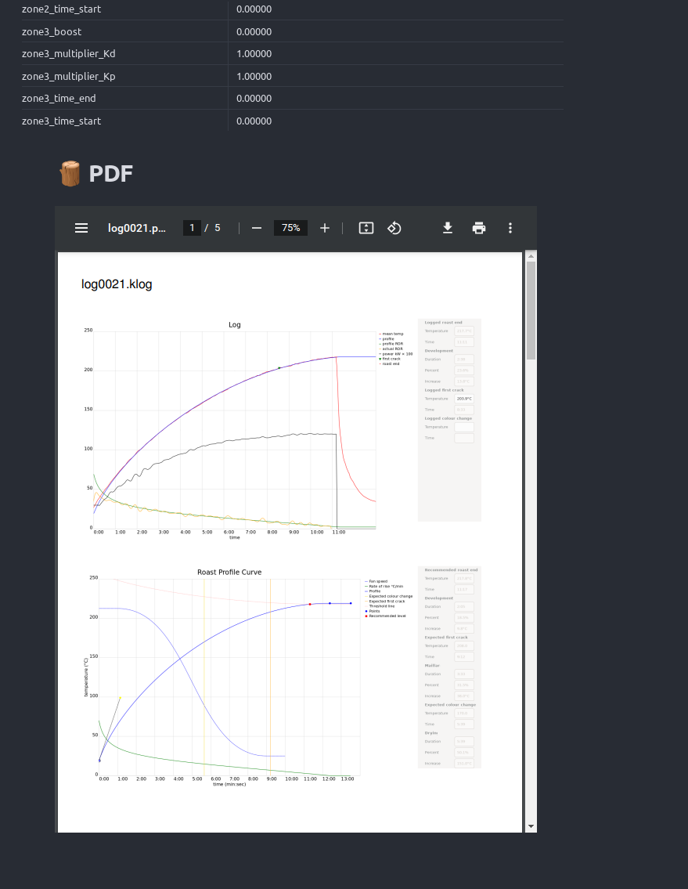

# Kaffelogic Plugin for Obsidian

**NOTE: THIS PLUGIN IS UNDER HEAVY DEVELOPMENT, UNSTABLE, AND AT SUPRE EARLY STAGE**

The Kaffelogic plugin for Obsidian helps importing Kaffelogic Roasts (KLog Files) into Obsidian. What it currently does:




- Alt + k -> Opens a new dialog to search for the log to import
- On import, it reads the log, extracts all the stats and writes them into a note in the form of a Markdown table
- Copies the original `klog` file into the attachment directory
- If a PDF for the log is present in the same directory, it will copy the PDF to the attachment directory as well

# Installation

**NOTE: This plugin currently depends on Templater. Please, make sure it's installed before using the Kaffelogic plugin.**

For now, I would recommend just cloning the repo and doing:

```
$ yarn install
$ yarn build
$ mv dist $YOUR_VAULT_DIR/.obsidian/plugins/Kaffelogic-obsidian
```

Once that's done, you can go into the `Community Plugins` section in obsidian
to enable the Kaffelogic plugin. Finally, configure the various paths in the
Kaffelogic settings and start importing your logs.

# Documentation (will eventually move into proper docs):

- `kl_log_var_{variable}` -> Will be replaced with the value of the variable chosen. The list of variables can be found [here](https://github.com/flaper87/obsidian-kaffelogic-plugin/blob/main/src/kaffelogic/constants.ts#L1) or in the settings tab
- `kl_log_table_{group_name}` -> Will be replaced with a table for the desired group. Groups are currently [hard-coded here](https://github.com/flaper87/obsidian-kaffelogic-plugin/blob/main/src/kaffelogic/constants.ts#L182)
- `kl_log_data_table` -> Will be replaced with the log table data
- `kl_log_attachment` -> Adds a link to the imported log
- `kl_log_attachment_pdf` -> Adds a link to the imported PDF (if present)

# Upcoming features / ideas

- Render a roast graph
- Allow to import all the logs with one command
- Allow to select what keys to import in the table
- Make these notes easier to search and link between them.
- Integrate better with templater so that users can customize the import process.


# Contributions and credits

- The code in the `src/fileSystem` module was mostly copied from the [obsidian-readwise](https://github.com/renehernandez/obsidian-readwise/) module.
- Lots of inspiration and learning from the amazing [Templater](https://github.com/SilentVoid13/Templater) plugin (including the CommandHandler).
